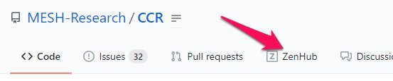
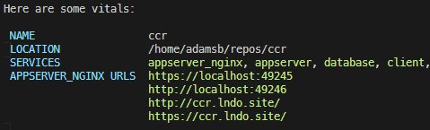

# Introduction

::: tip
CCR is in the beginning phases of its development process. As such, much of this documentation is evolving quickly. Please check back frequently to see what has changed!
:::

## Project Organization

Most of the work of the project is handled on our [GitHub repo](https://github.com/MESH-Research/CCR). The core team operates using an agile model, and we organize our sprints using [ZenHub](https://www.zenhub.com/). It's highly advisable to install the [ZenHub browser extension](https://www.zenhub.com/sign-up#). Once installed, you'll see a new tab in GitHub for our ZenHub board.

### Team Members
#### Core Developers

<TeamList filter="core"/>

## Code of Conduct

All contributors to the project must agree to adhere to our project's [Code of Conduct](https://github.com/MESH-Research/CCR/blob/master/CODE_OF_CONDUCT.md)

::: tip In summary

In the interest of fostering an open and welcoming environment, we as contributors and maintainers pledge to making participation in our project and our community a harassment-free experience for everyone, regardless of:

* age
* body size
* disability
* education
* ethnicity
* gender identity and expression
* level of experience
* nationality
* personal appearance
* race
* religion
* sex characteristics
* sexual identity and orientation
* socio-economic status
:::

The full text of out Code of Conduct is available in our repository: <https://github.com/MESH-Research/CCR/blob/master/CODE_OF_CONDUCT.md>

## Development Environments

We use a Docker-based container management system called [Lando](https://lando.dev/) to manage reusable development environments to ensure everyone is working with the same dependencies. To get started spinning up a development environment, you'll roughly need to follow these steps:

1. [Download and Install Lando and its dependencies.](https://docs.lando.dev/basics/installation.html)
2. Checkout the CCR repository on your local machine.
3. From the project root run, `lando start`.

Lando will then download the appropriate containers and get everything spun up. Once everything is installed and running, you should see:

You can then open a browser to <https://ccr.lndo.site/> and view the project running on your local machine.

### Lando tooling commands

Lando has built-in tooling commands that allow a developer to run commands inside a container from their terminal.

- `lando artisan`: Run Laravel's artisan command in the appserver container.
- `lando composer`: Run composer in the appserver container.
- `lando yarn`: Run yarn in the client container
- `lando mysql`: Start a MySQL client session (TIP: use `lando mysql laravel` to start with the CCR database selected)
- `lando quasar`: Run the quasar cli inside the client container

There are other useful tooling commands available. To view a list of all commands available, run `lando` at your command prompt with no arguments.

::: tip
Lando tooling commands will run inside the container in your current working directory. This means you should be careful to run composer, yarn, etc., inside the appropriate directories of the project, or you may end up inadvertently creating a new composer.json or package.json in a different part of the project than you intended.
The only exception to this is the `lando quasar` command which always runs in the `/client` directory.
:::

### Additional Local Configuration

You can create local containers or additional tooling commands by creating a `.lando.local.yml` file. These can be particularly helpful for creating containers that serve tooling like [Majestic UI](https://github.com/Raathigesh/majestic).

### Lando Tips and Tricks

- [Trusting the Lando CA Certificate](https://docs.lando.dev/config/security.html#trusting-the-ca)
- [ZSH Plugin](https://github.com/JoshuaBedford/lando-zsh)

## Contributor Workflow

1. Create a new branch based on the `development` branch
2. Work on your feature/fix
3. Open a pull request on GitHub to merge your branch into the `development` branch
4. Respond to feedback from the subsequent code review(s)
5. The pull request can be merged by a reviewer or a maintainer
