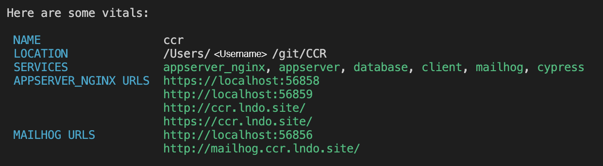

# Introduction

::: tip
Pilcrow is in the beginning phases of its development process. As such, much of this documentation is evolving quickly. Please check back frequently to see what has changed!
:::

## Project Organization

Most of the work of the project is handled on our [GitHub repo](https://github.com/MESH-Research/Pilcrow). The core team operates using an agile model, and we organize our sprints using [Zenhub](https://www.zenhub.com/). To access our Zenhub board, you can [sign up or log in on Zenhub](https://www.zenhub.com/sign-up).

If you have a supported browser, you can install the [Zenhub browser extension](https://www.zenhub.com/extension). Once installed, you'll see a new tab in GitHub for our Zenhub board.


### Team Members
#### Core Developers

<TeamList filter="core"/>

#### Emeriti
<TeamList filter="emeriti" />

## Code of Conduct

All contributors to the project must agree to adhere to our project's [Code of Conduct](https://github.com/MESH-Research/Pilcrow/blob/master/CODE_OF_CONDUCT.md)

::: tip In summary
In the interest of fostering an open and welcoming environment, we as contributors and maintainers pledge to making participation in our project and our community a harassment-free experience for everyone, regardless of age, body size, disability, ethnicity, sex characteristics, gender identity and expression, level of experience, education, socio-economic status, nationality, personal appearance, race, religion, or sexual identity and orientation.
:::

The full text of our Code of Conduct is available in our repository: <https://github.com/MESH-Research/Pilcrow/blob/master/CODE_OF_CONDUCT.md>

## Development Environments

We use a Docker-based container management system called [Lando](https://lando.dev/) to manage reusable development environments to ensure everyone is working with the same dependencies. To get started spinning up a development environment, you'll roughly need to follow these steps:

::: warning Windows
If you're using Windows as a development environment, please refer to the documentation on [setting up WSL before proceeding](./wsl.md). WSL is highly recommended for Windows development.
:::

::: warning Minimum Version
Pilcrow requires Lando version &ge; 3.0.25
:::

1. [Download and Install Lando and its dependencies.](https://docs.lando.dev/basics/installation.html)
2. Checkout the Pilcrow repository on your local machine.
3. From the project root run, `lando start`.

Lando will then download the appropriate containers and get everything spun up. Once everything is installed and running, you should see:



You can then open a browser to <https://pilcrow.lndo.site/> and view the project running on your local machine.

### Database Migration and Seeding

By default, the database of the application will be empty. To log in as a sample user, the database tables must be [migrated](https://laravel.com/docs/master/migrations) and [seeded](https://laravel.com/docs/master/seeding#main-content).

The commands to migrate and seed will need to be ran each time a new migration or seed is added to the repository.

#### Migrate and Seed

`lando artisan migrate:fresh --seed`

`:fresh` drops all tables in the database and then runs migrations. `--seed` will run the seeders after migrations complete.

#### Migrate Only

`lando artisan migrate:fresh`

#### Seed Only

`lando artisan db:seed`

Once seeding is complete, you can log in at <https://pilcrow.lndo.site/login> as any one of the sample users defined in `backend/database/seeders/UserSeeder.php` in the repository.

### Lando tooling commands

Lando has built-in tooling commands that allow a developer to run commands inside a container from their terminal.

- `lando artisan`: Run Laravel's artisan command in the appserver container.
- `lando composer`: Run composer in the appserver container.
- `lando yarn`: Run yarn in the client container.
- `lando mysql`: Start a MySQL client session (TIP: use `lando mysql laravel` to start with the Pilcrow database selected).
- `lando quasar`: Run the quasar cli inside the client container.
- `lando extras`: Manage and install tools into `.lando.local.yml`.
- `lando pandoc`: Run pandoc inside the appserver container

There are other useful tooling commands available. To view a list of all commands available, run `lando` at your command prompt with no arguments.

::: tip
Lando tooling commands will run inside the container in your current working directory. Therefore, you should be careful to run tools (composer, yarn, etc.) inside the appropriate directory, or you may end up inadvertently creating a new composer.json or package.json in a different part of the project.
The only exception to this is the `lando quasar` command, which always runs in the `/client` directory.
:::

### Additional Local Configuration

You can create local containers or additional tooling commands by creating a `.lando.local.yml` file.

Some containers are useful for specific development tasks but would unnecessarily bloat the development stack for day-to-day usage.  Our `lando extras` tooling command eases the friction associated with managing your `.lando.local.yml` file.  Run `lando extras` for a list of templates and instructions to enable and disable extras.

#### Testing Mail

[MailHog](https://github.com/mailhog/MailHog) can capture mail to aid debugging of email messages. MailHog is integrated as an extra in our Lando config.  To enable MailHog:

```sh
lando extras enable mailhog

lando rebuild
```

The MailHog interface will be available at <http://mailhog.pilcrow.lndo.site/> once the rebuild has finished.  Pilcrow's development environment will automatically route outgoing mail to MailHog's SMTP interface.


### Lando Tips and Tricks

- [Trusting the Lando CA Certificate](https://docs.lando.dev/config/security.html#trusting-the-ca)
- [ZSH Plugin](https://github.com/JoshuaBedford/lando-zsh)

## Public Test Environments

Two builds are automatically built in order to help testers and collaborators provide feedback on development features.

- [https://staging.pilcrow.dev](https://staging.pilcrow.dev): Automatically built from the `master` branch.  This is the "bleeding edge" of development.
- [https://release.pilcrow.dev](https://release.pilcrow.dev): Automatially built from the most recent versioned release. Releases happen after each development sprint (usually about once a month).
- [https://mailhog.pilcrow.dev](https://mailhog.pilcrow.dev): Email notifications from both environments are sent here, NOT to a real inbox.

::: warning
:warning: Data in the test environments is **not permanent** and will be reset **every** time their code base is updated.
:::

### User Login Information

The users below are permanent on the test servers, and will not be deleted. However, data associated with these users **may be reset at any time**.

Name | Username | Login email | Login Password
:---- | :---- | :---- | :----
Application Administrator | applicationAdminUser | `applicationadministrator@meshresearch.net` | `adminPassword!@#`
Publication Administrator | publicationAdministrator | `publicationAdministrator@meshresearch.net` | `publicationadminPassword!@#`
Publication Editor | publicationEditor | `publicationEditor@meshresearch.net` | `editorPassword!@#`
Review Coordinator for Submission | reviewCoordinator | `reviewCoordinator@meshresearch.net` | `coordinatorPassword!@#`
Reviewer for Submission | reviewer | `reviewer@meshresearch.net` | `reviewerPassword!@#`
Regular User | regularUser | `regularuser@meshresearch.net` | `regularPassword!@#`

Other users can be registered to the staging environment, but please note that these users and any data associated with them **may be wiped any time the code base is updated**.


## Contributor Workflow

1. Create a new branch based on the `development` branch
2. (Optional) Ensure your locally installed versions of the client dependencies match the `development` branch
    - Delete the `/client/node_modules` folder
    - Run `lando rebuild`
3. Work on your feature/fix
4. Open a pull request on GitHub to merge your branch into the `development` branch
5. Respond to feedback from the subsequent code review(s)
6. The pull request can be merged by a reviewer or a maintainer once approved

## Tagging a release

1. Check to make sure that tests on master are passing.
2. Run: `lando yarn release` to tag the release and update the changelog.
3. Push with tags: `git push --follow-tags`
4. Run `lando yarn release:details` to generate detailed changelog for MS Teams.
