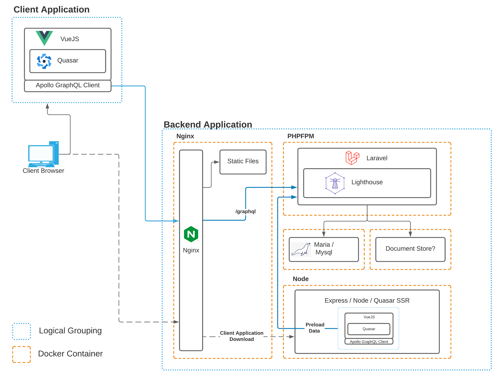

# Application Architecture

## Containers

CCR uses a multi-container docker architecture. Three primary containers serve the application:

- Proxy: An NGiNX container that proxies outside requests into the application.
- Application: A PHP-FPM container that provides the backend GraphQL API
- Database: A MySQL container that provides the relational DB

There are also a few other containers that only exist in the development environment.

- Client: A node container that builds the application and provides Hot-Module-Replacement (HMR)
- Docs: A development container for the documentation system.
- Test: A container to serve the Majestic interface for running Jest unit tests.

In a production environment, the application is compiled and served by the proxy container directly. The proxy container is the only public container in the stack. Requests for the `/graphql` or `/graphql-playground` (development mode only) are proxied to the [application server](#application-server). All other requests that are not for a static asset will return the compiled client's `index.html`.

Note: Our Lando development environment proxies client requests to a client container running `quasar dev` to allow for hot module replacement (HMR).

::: details Server-Side Rendering
Future architectures may employ a Node container for server-side rendering (SSR) to improve initial page load performance. For right now, though,
we've decided to defer implementing SSR and directly ship compiled assets via the proxy.
:::

## Application Server (API)

<CaptionImage href="https://laravel.com" :src="$withBase('/logos/laravel.jpg')" caption="Laravel" />
<CaptionImage href="https://lighthouse-php.com" :src="$withBase('/logos/lighthouse.png')" caption="Lighthouse" />

The backend API portion of the stack is a [Laravel](https://laravel.com) application with [Lighthouse](https://lighthouse-php.com) providing GraphQL server functionality. Laravel Sanctum provides authentication.

## Client (Quasar/Vue)

<CaptionImage href="https://quasar.dev" :src="$withBase('/logos/quasar.png')" caption="Quasar" />
<CaptionImage href="https://vuejs.org" :src="$withBase('/logos/vue.png')" caption="Vue" />
<CaptionImage href="https://apollographql.com" :src="$withBase('/logos/apollo.png')" caption="ApolloClient" />

The frontend client application is a [Quasar/Vue](https://quasar.dev) application. Interaction with the backend API is via [ApolloClient](https://apollographql.com).
