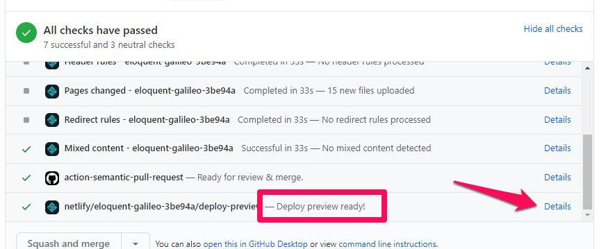

# Documentation

CCR's documentation (the site you're currently reading) is a [VuePress](https://vuepress.vuejs.org) site located in the `/docs` directory of the repo.  Our goal is to iterate the documentation site as features are added to the application.  All of the documentation files are [Markdown](https://www.markdownguide.org/getting-started/) with some minor Vue additions sprinkled in here and there.

::: tip Help CCR Grow

Helping improve documentation is a great way to help the project that doesn't require programming experience.

At the bottom of each page you should find a link to "Edit this Page".  Follow this link straight to the GitHub editing interface!
:::
## Automated Builds

The docuentation sites are automatically built by Github Actions powered by [Netlify](https://netlify.com).  There are a number of automatic builds configured.

- **<https://docs.ccrproject.dev>**: Automatically built from the `master` branch.
- **<https://development.ccrproject.dev>**: Automatially built from the `development` branch.

### Deploy Previews

Any pull request that contains changes to documentation will have a preview build deployed.  This is a great way to share proposed documentation changes for feedback and review.  

Look in the automated checks section of the pull request for the action with the text "Deploy Preview Ready!".  Clicking the "Details" link will open a new tab for the deploy preview website.

## Serving test Docs using Lando

It can be helpful to have a locally rendered version to see the results of your changes while editing documentation.  The `/docs` directory has its own [Lando](https://lando.dev) configuration file just for starting up a documentation development environment.

Inside the `/docs` directory run `lando start` to startup the container and proxy.  Once everything is up and running visit <https://docs_dev.lndo.site> to view your documentation build.  The container is using a development server so updates should happen automatically in the browser without requiring a refresh.
