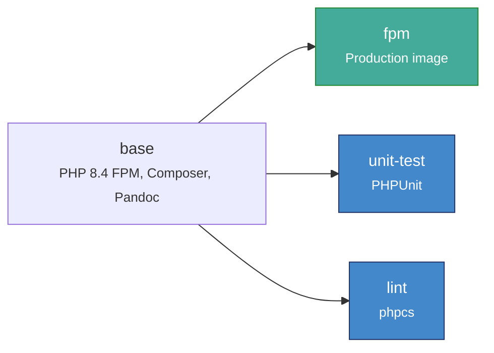
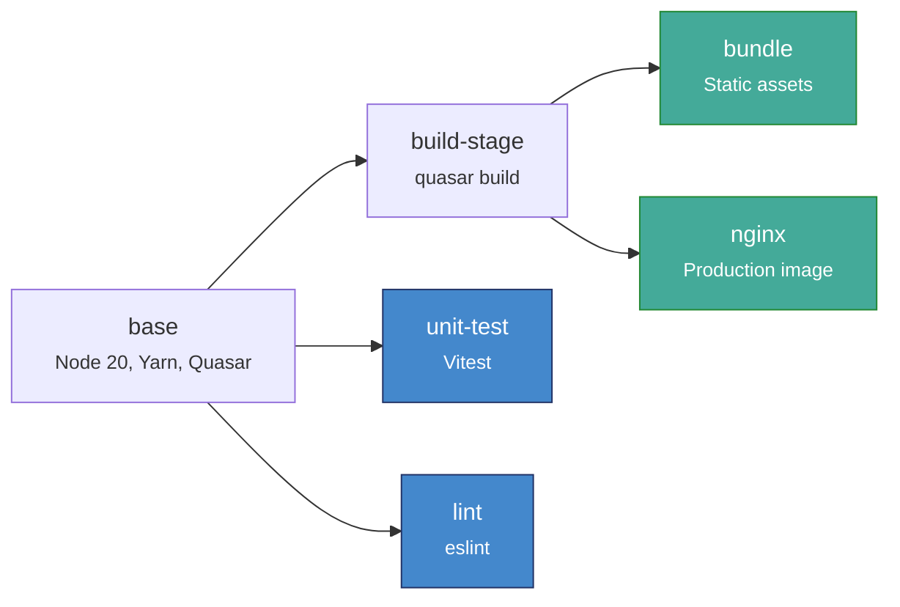
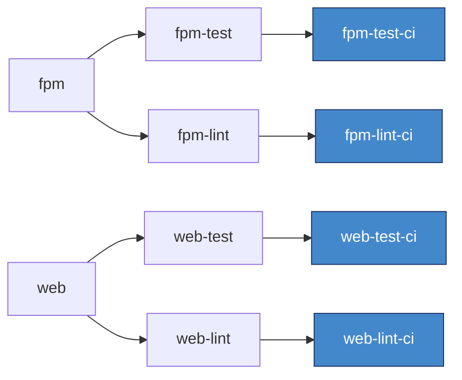
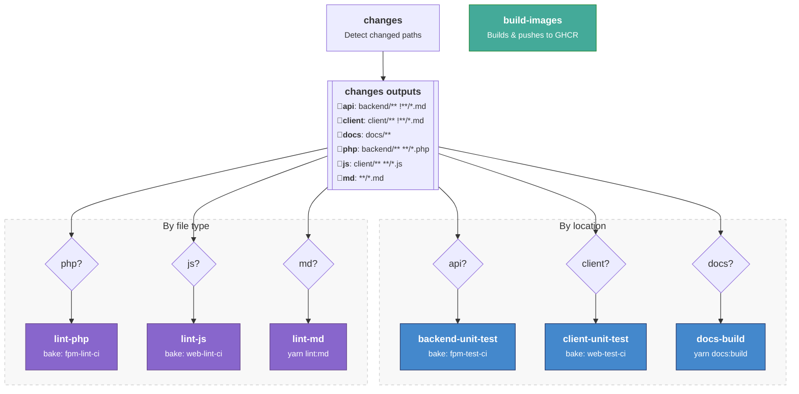

# Build System & CI

This document explains how Pilcrow's build system and continuous integration pipeline work.

## Overview

Pilcrow uses **Lando** for local development and **Docker buildx bake** for CI builds. The bake system provides a repeatable, debuggable build process that can be run locally when you need to investigate CI failures. While Lando and bake aren't identical environments, they run the same application code and tests where it matters.

The build configuration is defined in `docker-bake.hcl` at the project root.

### Key Components

| Component | Purpose |
| --------- | ------- |
| `docker-bake.hcl` | Build configuration for all Docker targets |
| `backend/Dockerfile` | Multi-stage Dockerfile for PHP/Laravel backend |
| `client/Dockerfile` | Multi-stage Dockerfile for Vue.js frontend |
| `.github/workflows/testing.yml` | GitHub Actions CI workflow |
| `scripts/test-backend-bake.sh` | Local script to run backend tests using bake |

## Docker Build Targets

The `docker-bake.hcl` file defines several build targets:

### Production Targets

| Target | Description |
| ------ | ----------- |
| `fpm` | Production PHP-FPM image for the backend |
| `web` | Production Nginx image serving the client |

### Test & Lint Targets

| Target | Description |
| ------ | ----------- |
| `fpm-test` | Runs backend PHPUnit tests |
| `fpm-lint` | Runs PHP linting (phpcs) |
| `web-test` | Runs client Vitest unit tests |
| `web-lint` | Runs JavaScript/Vue linting |

### CI Targets

CI uses variants with the `-ci` suffix (e.g., `fpm-test-ci`) which inherit from the base targets but add GitHub Actions cache configuration.

## Dockerfile Stages

Both the backend and client use multi-stage Dockerfiles. Each stage serves a specific purpose in the build pipeline.

### Backend (`backend/Dockerfile`)



- **base** - PHP 8.4 FPM with extensions, Composer, and Pandoc. Installs production dependencies.
- **fpm** - Production image.
- **unit-test** - Adds dev dependencies, configures PHP for testing (matches `.lando/php.ini`), runs migrations and PHPUnit.
- **lint** - Adds dev dependencies, runs `composer lint`.

### Client (`client/Dockerfile`)



- **base** - Node.js 20 Alpine with Yarn and Quasar.
- **build-stage** / **bundle** / **nginx** - Build pipeline producing the production Nginx image.
- **unit-test** - Runs Vitest with CI reporter.
- **lint** - Runs `yarn lint`.

### Bake Target Inheritance

The `docker-bake.hcl` file maps bake targets to Dockerfile stages and adds CI-specific configuration:



Each bake target inherits from its parent. The `-ci` variants add GitHub Actions cache configuration.

## GitHub Actions CI Pipeline

The CI pipeline (`.github/workflows/testing.yml`) runs on:
- Pull requests
- Merge queue
- Pushes to `master` and `renovate/*` branches

### Jobs



The `changes` job runs first and detects which paths were modified, setting boolean outputs for each area of the codebase. Downstream jobs check these outputs to decide whether to run. Most jobs invoke a Docker buildx bake target (e.g. `fpm-test-ci`, `web-lint-ci`), which builds and runs the corresponding Dockerfile stage. The exceptions are `docs-build` and `lint-md`, which run directly via Node.js. `build-images` runs on every push regardless of what changed and builds and pushes images to GHCR.

### Backend Unit Tests in CI

The backend tests require a MySQL database. CI configures this as a service container:

```yaml
services:
  mysql:
    image: mysql:5.7
    ports:
      - 3306:3306
    env:
      MYSQL_ROOT_PASSWORD: pilcrow
      MYSQL_DATABASE: pilcrow
    options: >-
      --health-cmd "mysqladmin ping -h 127.0.0.1 -uroot -ppilcrow"
      --health-interval 10s
      --health-timeout 5s
      --health-retries 3
```

The `fpm-test` target uses `network = "host"` by default to allow the Docker build to connect to the MySQL service on localhost. This is controlled by the `NETWORK` variable in `docker-bake.hcl`, which can be overridden for environments where host networking doesn't work (see [Running Bake on macOS](#running-bake-on-macos-apple-silicon)).

## PHP Configuration

Both Lando and CI use the same PHP configuration for consistency:

| Setting | Value | Purpose |
| ------- | ----- | ------- |
| `error_reporting` | `E_ALL & ~E_DEPRECATED` | Report all errors except deprecations |
| `display_errors` | `On` | Show errors in output |
| `memory_limit` | `256M` | Sufficient for tests and development |
| `mysqlnd.collect_memory_statistics` | `Off` | Reduces memory overhead |

Both environments use the same file (`backend/php.dev.ini`) but apply it differently:

- **Lando** copies the file into `conf.d/` as `zzz-lando-my-custom.ini` during `lando rebuild`, so it loads last and overrides Lando's built-in PHP configuration.
- **Dockerfile** COPYs it into `conf.d/` during the `unit-test` stage, where it is loaded after the base `php.ini-production` set in the `base` stage.

Because the two environments have different base configurations and load orders, there *can be* minor inconsistencies between them. In practice this will rarely be noticed, but it is noted here for those difficult-to-debug cases where differences in PHP configuration between Lando and CI may be a factor.

## Locally Testing Bake Targets

### Why Use Bake Locally?

Lando (`lando artisan test`) is the primary way to run tests during development. However, when CI fails and you need to debug the issue, running tests via bake gives you a repeatable environment that mirrors CI:

- **Debugging CI failures** - Reproduce the exact failure locally
- **Verifying fixes** - Confirm your fix works in the CI environment before pushing
- **Clean slate testing** - Run in an isolated environment without local state

### Backend Tests

::: warning macOS Not Supported
The `test-backend-bake.sh` script does not currently work on macOS (Apple Silicon). Use Lando (`lando artisan test`) to run backend tests on macOS. See [Running Bake on macOS](#running-bake-on-macos-apple-silicon) for details and [issue #2224](https://github.com/MESH-Research/Pilcrow/issues/2224) for status.
:::

Use the provided script:

```bash
./scripts/test-backend-bake.sh
```

This script:
1. Starts a MySQL 5.7 container (matching CI)
2. Waits for MySQL to be ready
3. Runs `docker buildx bake fpm-test`
4. Cleans up the MySQL container on exit

Options:
- `--no-cache`: Force a fresh build without Docker cache
- `--docker-network`: Force the Docker network path (used automatically on macOS, useful for testing on Linux/WSL)

### Manual Bake Commands

For other targets, run bake directly:

```bash
# Run backend linting
docker buildx bake fpm-lint

# Run client tests
docker buildx bake web-test

# Run client linting
docker buildx bake web-lint
```

### Cache Considerations

Docker buildx caches build layers based on the instructions and inputs. This is great for speeding up builds, but problematic for test runs.

**The problem:** If you run `docker buildx bake fpm-test` twice without changing any files, Docker sees that nothing has changed and returns the cached result from the first run. The tests don't actually execute the second time - you just see the previous output.

**The solution:** The `BUILDSTAMP` build argument exists specifically to bust the cache for test runs. Since Docker includes ARG values in its cache key calculation, changing `BUILDSTAMP` invalidates the cache for the test layer:

```bash
# This will actually re-run the tests
BUILDSTAMP=$(date +%s) docker buildx bake fpm-test
```

The Dockerfile declares `ARG BUILDSTAMP` immediately before the test command, so only the test layer is invalidated - earlier layers (dependencies, migrations) remain cached.

If you're seeing stale behavior or need a completely fresh build:

```bash
# Clear buildx cache
docker buildx prune

# Or run with --no-cache
docker buildx bake --no-cache <target>

# Via the test script
./scripts/test-backend-bake.sh --no-cache
```

## Troubleshooting

### Backend Tests Fail in CI but Pass in Lando

This is the most common scenario where bake becomes useful.

1. Run tests using bake to reproduce the CI environment locally:
   ```bash
   ./scripts/test-backend-bake.sh
   ```

2. Common differences to check:
   - **MySQL version** - CI uses MySQL 5.7
   - **PHP extensions** - CI may have different extensions installed

### MySQL Connection Refused

The `test-backend-bake.sh` script waits for MySQL to be ready, but if you're running bake manually:

1. Ensure MySQL is running on port 3306
2. Verify the database `pilcrow` exists
3. Check credentials: `root` / `pilcrow`

### Running Bake on macOS (Apple Silicon)

The buildx bake targets are primarily developed for CI/CD and tested on Linux (including WSL2). Running them on macOS with Apple Silicon (M1/M2/M3/M4) requires a different buildx driver, which introduces networking and platform challenges that are not yet fully resolved. See [issue #2224](https://github.com/MESH-Research/Pilcrow/issues/2224) for status.

**Why macOS is different:** On Linux, buildx uses the default driver, which runs builds directly on the host. `network = "host"` gives the build process direct access to `localhost`, where MySQL is listening. On macOS, Docker runs inside a Linux VM, so `localhost` inside a build doesn't reach services on the Mac. Additionally, Apple Silicon requires the `docker-container` buildx driver to build `linux/arm64` images. This driver runs builds inside a separate BuildKit container, which has its own network namespace — `network = "host"` gives the build access to that container's network, not the Mac's. To connect the build to MySQL, both the MySQL container and the BuildKit container must be placed on a shared Docker network, but this path has known issues with SSL certificate verification and BuildKit network mode support.

**Platform resolution:** The `docker-container` driver doesn't support the `"local"` platform shorthand used in `docker-bake.hcl`. Set the `LOCAL_PLATFORM` environment variable when running bake targets manually:

```bash
# Apple Silicon
LOCAL_PLATFORM=linux/arm64 docker buildx bake fpm-lint

# Intel Mac
LOCAL_PLATFORM=linux/amd64 docker buildx bake fpm-lint
```
