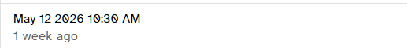
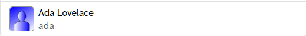

# Cell renderers

`QueryTable` ships with reusable cell renderer components in
`src/components/tables/common/`. Set `column.component` to one of
them to swap in richer rendering without writing a slot.

```ts
import DateTimeCell from "src/components/tables/common/DateTimeCell.vue"

const columns: QueryTableColumn[] = [
  { name: "created_at", field: "created_at", component: DateTimeCell }
]
```

All built-in renderers accept the same `scope` prop — the body-cell
slot scope Quasar would otherwise pass — and read column-level
configuration (e.g. `aside`, `hideUsername`) from `scope.col`. None
of them require additional props on the column beyond the standard
`field`.

## WithAsideCell

<figure class="screenshot">
  
  <figcaption>WithAsideCell: title row above publication caption.</figcaption>
</figure>

Two-line cell: primary value above a muted caption.

| Source | Where the value comes from |
|--------|----------------------------|
| Main line | `scope.value` (the column's `field`) or `#value` slot |
| Caption | `column.aside` + `column.asideLabel` or `#aside` slot |

**Column options.** Set these on the `QueryTableColumn`:

| Field | Type | Description |
|-------|------|-------------|
| `aside` | `string \| ((row) => string)` | Caption text. String form is treated as a dot path into the row; function form is called with the row. |
| `asideLabel` | `string \| ((row) => string)` | Optional descriptive label rendered before the aside value (e.g. `Publication: Acme Press`). |

When the consumer overrides the `#aside` slot, both column fields
are ignored.

```ts
{
  name: "title",
  field: (row) => row.submission.title,
  component: WithAsideCell,
  aside: (row) => row.submission.publication.name,
  asideLabel: "Publication"
}
```

Or override per-table via slot:

```vue
<template #body-cell-title="scope">
  <WithAsideCell :scope="scope">
    <template #aside>
      {{ $t("admin.users.details.submissions.aside.publication") }}:
      {{ scope.row.submission.publication.name }}
    </template>
  </WithAsideCell>
</template>
```

## DateTimeCell

<figure class="screenshot">
  
  <figcaption>DateTimeCell: absolute date above relative-time caption.</figcaption>
</figure>

Renders an ISO timestamp as an absolute date with a relative-time
caption beneath. Built on `WithAsideCell` and `useTimeAgo`.

- Main line: `LLL d yyyy h:mm a` (e.g. `May 18 2026 4:25 PM`)
- Caption: long-form relative time (e.g. `3 days ago`)

```ts
{ name: "created_at", field: "created_at", component: DateTimeCell }
```

The column's `field` must resolve to an ISO 8601 string. No extra
configuration.

## NameAvatarCell

<figure class="screenshot">
  
  <figcaption>NameAvatarCell: avatar + display name + username caption.</figcaption>
</figure>

Renders an avatar alongside the user's display name with the
username in a caption. Designed for `User` rows.

- `field` must return a `User`-shaped object (or `null`). The
  component spreads the `NameAvatarCell` GraphQL fragment, so query
  selections should include it:

  ```graphql
  query GetUsers(...) {
    users(...) {
      data {
        id
        ...NameAvatarCell
      }
    }
  }
  ```

- Null users render as a grey em-dash with an
  `admin.users.no_user_assigned` aria label.

**Column options.** Set these on the `QueryTableColumn`:

| Field | Type | Description |
|-------|------|-------------|
| `hideUsername` | `boolean` | Suppress the username caption below the display name — useful when a dedicated username column already exists. |

```ts
{
  name: "name",
  field: (row) => row,
  component: NameAvatarCell,
  hideUsername: true
}
```

## Custom cell renderers

When the built-in cell components don't fit, write a custom renderer.
A renderer is a regular Vue SFC that accepts the body-cell scope from
`QueryTable` and renders the `<q-td>` itself.

Use a custom renderer (over an inline `#body-cell-{name}` slot) when:

- The same rendering is needed in more than one table.
- The cell carries non-trivial logic (formatting, fragment data,
  links, async state) you'd rather not duplicate.
- The cell reads column-level configuration (`aside`, `linkTo`, etc.)
  and you want it to compose with `QueryTableColumn` extensions.

Reach for a slot instead when the markup is one-off and doesn't
warrant a new file.

### Anatomy

A renderer:

1. Accepts a single `scope` prop typed `QTableBodyCellScope`.
2. Renders its own `<q-td>` — `QueryTable` does not wrap the
   component output.
3. Optionally reads `scope.col` for column-level config and
   `scope.dense` for layout hints.

```vue
<!-- src/components/tables/common/StatusCell.vue -->
<template>
  <q-td :props="scope" :dense="scope.dense">
    <q-chip :color="color" text-color="white" dense>
      {{ label }}
    </q-chip>
  </q-td>
</template>

<script setup lang="ts">
import { computed } from "vue"
import { useI18n } from "vue-i18n"
import type { QTableBodyCellScope } from "../QueryTable.vue"

interface Props {
  scope: QTableBodyCellScope
}

const props = defineProps<Props>()
const { t } = useI18n()

const status = computed(() => props.scope.value as string)
const label = computed(() => t(`submission.status.${status.value}`))
const color = computed(() =>
  status.value === "ACCEPTED" ? "positive" : "grey-7"
)
</script>
```

Wire it in:

```ts
import StatusCell from "src/components/tables/common/StatusCell.vue"

const columns: QueryTableColumn[] = [
  {
    name: "status",
    field: (row) => row.submission.status,
    component: StatusCell
  }
]
```

### Scope shape

`QTableBodyCellScope` is exported from
`src/components/tables/QueryTable.vue`:

| Field | Type | Description |
|-------|------|-------------|
| `value` | `unknown` | Result of the column's `field` (string property or function) applied to the row. |
| `row` | `Record<string, unknown>` | Full row object. |
| `col` | `QTableColumn` | The column definition. Cast to `QueryTableColumn` to read project extensions (`aside`, `linkTo`, `hideUsername`, etc.). |
| `dense` | `boolean` | Forwarded from `QueryTable`'s `dense` prop. |

Standard Quasar body-cell scope fields (`rowIndex`, `pageIndex`,
`expand`, `selected`, etc.) are present on `scope` at runtime; add
them to the typed `Props` interface only when you actually need
them.

### Reading column-level config

If your renderer wants to expose its own column options, declare
them in a local interface and cast `scope.col`:

```ts
interface MyColumn {
  linkTo?: (row: Record<string, unknown>) => RouteLocationRaw
}

const linkTo = computed(() => {
  const col = props.scope.col as QueryTableColumn & MyColumn
  return col.linkTo?.(props.scope.row)
})
```

When the option is broadly useful, promote it onto `QueryTableColumn`
in `QueryTable.vue` so other tables and renderers can share it.

### GraphQL fragments

A renderer **can** colocate a GraphQL fragment with the component
and have callers spread it into their query's `data` selection.
This is optional — small one-row-field renderers don't need it —
but for renderers consuming several fields it's the cleanest path:
the renderer owns its data shape, callers don't have to remember
which fields belong to which cell, and adding a new field is a
single-file change instead of a sweep across every consuming page.

```vue
<script lang="ts">
import { graphql } from "src/graphql/generated"

graphql(`
  fragment StatusCell on Submission {
    status
    status_reason
  }
`)
</script>
```

```graphql
query GetSubmissions(...) {
  submissions(...) {
    data {
      id
      ...StatusCell
    }
  }
}
```

This keeps the renderer's data needs visible at the call site and
plays well with codegen.

### Where to put renderers

- **Cross-table, generic** — `src/components/tables/common/`.
- **Feature-specific** — colocate near the feature
  (e.g. `src/pages/Admin/components/`), since `column.component`
  accepts any component reference.

### Testing

Render the cell inside a `<q-table>` (or stub it) in a Vitest spec.
Pass a fabricated scope object — the component does not depend on
`QueryTable` being mounted in the tree. See
`useUrlPaginationSync.vitest.spec.ts` for setup conventions.
