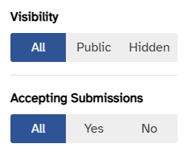

# Adding filters to a QueryTable

`QueryTable` owns search, sort, and pagination. Everything else —
status filters, type filters, date ranges, parent IDs — is the
caller's responsibility, wired in through the `variables` prop and
(when desired) mirrored to the URL by the page itself.

This page covers the conventional shape: a filter panel in the
table's top bar, reactive variables, page reset on change, and URL
sync.

## The pieces

A filtered table needs four things:

1. The GraphQL query declares each filter as a variable.
2. The page holds filter state in refs.
3. A `variables` computed shapes the refs into the query's variable
   names and skips falsy/default values.
4. A watcher on the filter state resets the table to page 1 and
   (optionally) reflects the state in the URL.

Render the filter UI with `#top-extra` or `#top-after` on
`QueryTable`. Extract anything more than a single dropdown into its
own component.

## End-to-end example

```vue
<template>
  <QueryTable
    ref="queryTableRef"
    :query="GetAdminPublicationsDocument"
    t-prefix="admin.publication"
    :columns="columns"
    :variables="filterVariables"
    sync-url
    :default-sort="{ sortBy: 'name' }"
  >
    <template #top-after>
      <PublicationsFilterPanel
        v-model:visibility-filter="visibilityFilter"
        v-model:accepting-filter="acceptingFilter"
      />
    </template>
  </QueryTable>
</template>

<script lang="ts">
import { graphql } from "src/graphql/generated"

graphql(`
  query GetAdminPublications(
    $page: Int
    $first: Int
    $search: String
    $orderBy: [QueryPublicationsOrderByOrderByClause!]
    $public: Boolean
    $accepting_submissions: Boolean
  ) {
    publications(
      page: $page
      first: $first
      search: $search
      orderBy: $orderBy
      public: $public
      accepting_submissions: $accepting_submissions
    ) {
      ...QueryTable
      data {
        id
        name
        is_publicly_visible
        is_accepting_submissions
      }
    }
  }
`)
</script>

<script setup lang="ts">
import { ref, computed, watch } from "vue"
import QueryTable from "src/components/tables/QueryTable.vue"
import PublicationsFilterPanel, {
  defaultVisibility,
  defaultAccepting,
  type VisibilityFilter,
  type AcceptingFilter
} from "src/pages/Admin/components/PublicationsFilterPanel.vue"

const queryTableRef = ref<InstanceType<typeof QueryTable> | null>(null)

const visibilityFilter = ref<VisibilityFilter>(defaultVisibility)
const acceptingFilter = ref<AcceptingFilter>(defaultAccepting)

const filterVariables = computed(() => {
  const vars: Record<string, unknown> = {}
  if (visibilityFilter.value !== "all") {
    vars.public = visibilityFilter.value === "public"
  }
  if (acceptingFilter.value !== "all") {
    vars.accepting_submissions = acceptingFilter.value === "yes"
  }
  return vars
})

watch([visibilityFilter, acceptingFilter], () => {
  if (queryTableRef.value) queryTableRef.value.page = 1
})
</script>
```

## Where to mount filter UI

`QueryTable` exposes three top-bar slots:

| Slot         | Position                            | Use for                                   |
| ------------ | ----------------------------------- | ----------------------------------------- |
| `top-before` | Left of the search input            | Rare — section labels, mode toggles.      |
| `top-extra`  | Between search and create button    | Most filters live here.                   |
| `top-after`  | Right of the create/refresh buttons | Filter panel triggers, secondary actions. |

The publications page uses `#top-after` because the filter is a
single `q-btn` that opens a `q-menu`. If your filter is an inline
dropdown that should sit beside the search, use `#top-extra`.

## Shaping `variables`

`QueryTable` passes the `variables` prop to Apollo on every refetch,
merged on top of its own managed variables (`page`, `first`,
`search`, `orderBy`). Two conventions:

**Omit defaults.** When the filter is in its "show everything" state
(`"all"` in the example below), skip the variable entirely so the
server applies no filter. Keeps the resolver cheap and the query
cache reusable across users who haven't touched the filter.

**Map UI shape to server shape.** The UI works in terms the user
understands ("Public" / "Hidden" / "All"); the server takes a
`Boolean`. The computed bridges that — emit `true`/`false` when one
end is selected, omit the variable when set to `"all"`.

```ts
const filterVariables = computed(() => {
  const vars: Record<string, unknown> = {}
  if (visibilityFilter.value !== "all") {
    vars.public = visibilityFilter.value === "public"
  }
  return vars
})
```

For filters that map 1:1 to a server variable, the computed is
trivial:

```ts
const filterVariables = computed(() => ({
  status: statusFilter.value || undefined
}))
```

## Reset to page 1 on filter change

Without this, changing a filter while on page 4 leaves the user
looking at the filtered set's page 4 — which is usually empty.

```ts
watch([visibilityFilter, acceptingFilter], () => {
  if (queryTableRef.value) queryTableRef.value.page = 1
})
```

`QueryTable` exposes `page` as a writable ref via its public API
(see [QueryTable › Exposed methods](./index.md#exposed-methods)).

## Persisting filters in the URL

`sync-url` only mirrors page, search, and sort. Filter state is the
caller's responsibility — read from `route.query` on mount, write
back via `router.replace` on change.

```ts
const route = useRoute()
const router = useRouter()

function parseVisibility(value: unknown): VisibilityFilter {
  return value === "public" || value === "hidden" ? value : defaultVisibility
}

const visibilityFilter = ref<VisibilityFilter>(
  parseVisibility(route.query.visibility)
)

watch(visibilityFilter, (value) => {
  const query = { ...route.query } as Record<string, string>
  if (value !== defaultVisibility) query.visibility = value
  else delete query.visibility
  router.replace({ query })
})
```

Two conventions worth keeping:

- **Drop defaults from the URL.** A URL with no filter params is
  the "everything" view. Don't write `?visibility=all` when that's
  the default.
- **Use `router.replace`, not `push`.** Filter changes shouldn't
  pile up in browser history.
- **Validate on parse.** Untrusted URL input — only accept known
  literal values, fall back to the default on anything else.

## Filter panels

<figure class="screenshot">
  
  <figcaption>PublicationsFilterPanel: tri-state segmented buttons (All / value-true / value-false). No "none selected" state is reachable.</figcaption>
</figure>

When a page needs more than one filter, extract them into a
dedicated component (see
`src/pages/Admin/components/PublicationsFilterPanel.vue` for the
template). Conventions:

- Expose each filter via `defineModel` so the parent owns state.
- Export the default value (e.g. `defaultVisibility = "all"`) and
  its type so the parent can detect "no-op" state without
  duplicating string literals.
- Prefer `q-btn-toggle` for tri-state filters (true / false /
  either) — it can't reach an empty state and maps cleanly to a
  nullable server variable.
- Use `q-menu` from a single `q-btn` trigger to keep the table
  top bar compact.
