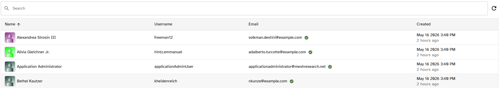

# QueryTable

<figure class="screenshot">
  
  <figcaption>QueryTable: search input, sortable headers, cell renderers, and pagination footer.</figcaption>
</figure>

`QueryTable` is the project's standard data table. It wraps Quasar's
[`q-table`](https://quasar.dev/vue-components/table) with paginated
GraphQL fetching, URL state sync, i18n-aware headers, and a row-level
component slotting convention.

Reach for `QueryTable` any time you need to render a paginated list
backed by a GraphQL query. If you need a plain non-paginated table,
use `q-table` directly.

## Basic usage

```vue
<template>
  <QueryTable
    :query="GetUsersDocument"
    t-prefix="admin.users"
    :columns="columns"
    sync-url
    :default-sort="{ sortBy: 'name' }"
    @row-click="onRowClick"
  />
</template>

<script setup lang="ts">
import QueryTable, {
  type QueryTableColumn
} from "src/components/tables/QueryTable.vue"
import { GetUsersDocument } from "src/graphql/generated/graphql"

// Each column's header comes from admin.users.headers.<name>.
// Defining those keys is required — see Internationalization below.
const columns: QueryTableColumn[] = [
  { name: "name", field: "name", sortable: true },
  { name: "email", field: "email", sortable: true }
]

function onRowClick(_evt: Event, row: { id: string }) {
  // ...
}
</script>
```

## Props

Grouped by concern. `QueryTable` forwards all other `q-table` props
transparently via `v-bind`, so anything documented on `q-table` works
here unless this component owns it (pagination, rows, columns,
loading, request).

### Query

How data is fetched and where the paginator lives in the result.

| Prop          | Type                                       | Default | Description                                                                                                                     |
| ------------- | ------------------------------------------ | ------- | ------------------------------------------------------------------------------------------------------------------------------- |
| `query`       | `DocumentNode`                             | —       | GraphQL document. Must select the paginator fields via the `QueryTable` fragment. See [Structuring queries](./queries.md).      |
| `field`       | `string`                                   | `""`    | Dotted path from the query result to the paginator (e.g. `"user.submissions"`). Omit when the paginator is the top-level field. |
| `variables`   | `Record<string, unknown>`                  | `{}`    | Extra GraphQL variables (filters, ids). Pagination, search, and sort variables are managed by `QueryTable`.                     |
| `defaultSort` | `{ sortBy: string; descending?: boolean }` | —       | Initial sort applied when no URL state is present.                                                                              |

### Columns prop

What renders in each row.

| Prop             | Type                 | Default | Description                                  |
| ---------------- | -------------------- | ------- | -------------------------------------------- |
| `columns`        | `QueryTableColumn[]` | —       | Column definitions. See [Columns](#columns). |
| `visibleColumns` | `string[]`           | —       | Forwarded to `q-table`.                      |

### Top bar

The create/refresh/search affordances above the table.

| Prop         | Type               | Default | Description                                              |
| ------------ | ------------------ | ------- | -------------------------------------------------------- |
| `newTo`      | `RouteLocationRaw` | —       | Renders a "Create" button that routes to this location.  |
| `onNew`      | `() => void`       | —       | Alternative to `newTo` — emits `new` instead of routing. |
| `refreshBtn` | `boolean`          | `true`  | Show the manual refresh button in the top bar.           |
| `searchHint` | `string`           | `""`    | Helper text rendered below the search input.             |

### Labels & i18n

How labels resolve.

| Prop      | Type                  | Default | Description                                                                                                                                                     |
| --------- | --------------------- | ------- | --------------------------------------------------------------------------------------------------------------------------------------------------------------- |
| `tPrefix` | `string`              | `""`    | i18n prefix used for column headers (`${tPrefix}.headers.${column.name}`). Does not affect the built-in search/create/refresh buttons. See [Headers](#headers). |
| `labels`  | `QueryTableLabelKeys` | `{}`    | Override the i18n keys used for the search placeholder, create button, and refresh button. See [Built-in chrome labels](#built-in-chrome-labels).               |

### State & URL

State mirroring.

| Prop      | Type      | Default | Description                                                    |
| --------- | --------- | ------- | -------------------------------------------------------------- |
| `syncUrl` | `boolean` | `false` | Mirror page, search, and sort state into the URL query string. |

### Style & layout

Visual presentation. Forwarded to `q-table`.

| Prop    | Type      | Default | Description                                        |
| ------- | --------- | ------- | -------------------------------------------------- |
| `dense` | `boolean` | `false` | Forwarded to `q-table` and to row cell components. |
| `grid`  | `boolean` | `false` | Forwarded to `q-table`.                            |

## Events

| Event       | Payload             | Notes                                                                                                                |
| ----------- | ------------------- | -------------------------------------------------------------------------------------------------------------------- |
| `row-click` | `(evt, row, index)` | Only forwarded when the parent listens — prevents the hover-pointer cursor from appearing on non-interactive tables. |
| `new`       | `()`                | Emitted when `onNew` is set and the Create button is clicked.                                                        |

## Columns

`QueryTableColumn` extends Quasar's
[`QTableColumn`](https://quasar.dev/vue-components/table#qtablecolumn-api).
All standard fields (`name`, `field`, `align`, `sortable`, `format`,
etc.) work as documented by Quasar.

Project-specific extensions:

| Field       | Type                        | Description                                                                                                      |
| ----------- | --------------------------- | ---------------------------------------------------------------------------------------------------------------- |
| `component` | `Component`                 | Cell renderer. Import the component and pass the reference directly. The cell receives `{ scope, dense }` props. |
| `linkTo`    | `(row) => RouteLocationRaw` | When supported by the cell component (e.g. `TextCell`), wraps the cell content in a `router-link`.               |

Renderer-specific column fields (e.g. `WithAsideCell`'s `aside`,
`NameAvatarCell`'s `hideUsername`) live with their renderer in
[Cell renderers](./cells.md).

### Body cell components

Two ways to render a custom cell:

1. **Declarative** — set `column.component`. Prefer for reusable
   cells. See [Cell renderers](./cells.md) for the built-in set
   and [Custom cell renderers](./cells.md#custom-cell-renderers)
   for authoring guidance.
2. **Slot** — pass `#body-cell-{name}` from the caller for one-off
   custom markup.

When both exist, the slot wins (Vue slot precedence).

## Internationalization

### Headers

**Convention: every column header must have an i18n entry.**

Column headers resolve from `${tPrefix}.headers.${column.name}`.
There is no fallback path — `QueryTableColumn` does not expose a
`label` field at all. Missing keys render as the key string and
log `[QueryTable] missing header translation: …` to the console
in dev, so a missing translation is immediately visible.

```ts
// tPrefix="admin.users"
const columns: QueryTableColumn[] = [
  { name: "name", field: "name" },
  { name: "email", field: "email" }
]
```

```json
// en-US.json — required for every column above
{
  "admin": {
    "users": {
      "headers": {
        "name": "Name",
        "email": "Email"
      }
    }
  }
}
```

For columns with no visible header (icon-only action columns,
checkboxes, etc.) still define the key — set it to an empty string
or a noun describing the column for assistive tech:

```json
{ "admin": { "users": { "headers": { "actions": "" } } } }
```

### Built-in chrome labels

The search input, Create button, and refresh button each resolve
their text from a dedicated i18n key that is independent of
`tPrefix`. Defaults:

| Element               | Default key                     |
| --------------------- | ------------------------------- |
| Search placeholder    | `queryTable.search.placeholder` |
| Create button         | `buttons.create`                |
| Refresh button (aria) | `buttons.refresh`               |

The `queryTable.*` namespace exists specifically for table-shell
labels. The Create/Refresh defaults reuse the project-wide
`buttons.*` namespace so they stay consistent with buttons
elsewhere in the app.

To override any of these for a single table, pass the `labels`
prop with the new key(s):

```vue
<QueryTable
  :query="GetThingsDocument"
  t-prefix="things"
  :columns="columns"
  :labels="{
    create: 'things.actions.new',
    search: 'things.search.placeholder'
  }"
/>
```

The override is a key, not a literal — it goes through `t()`. Any
omitted key falls back to the default above.

## URL synchronization

With `sync-url`, `QueryTable` keeps its internal state in sync with
the route's query string. The following keys are mirrored both ways:

| Query key | Source                  | Notes                                                        |
| --------- | ----------------------- | ------------------------------------------------------------ |
| `page`    | Current page number     | Omitted when on page 1.                                      |
| `perPage` | Rows per page           | Omitted when at the default (25).                            |
| `search`  | Search input value      | Omitted when empty.                                          |
| `sortBy`  | Active sort column name | Omitted when no sort.                                        |
| `sortDir` | Sort direction          | Set to `desc` only when sorted descending; absent otherwise. |

What this gets you:

- **Shareable URLs.** Paste a link to a sorted/searched view and the
  recipient lands on the same state. Useful for support tickets,
  bug reports, and bookmarks.
- **Browser back / forward** moves through prior states instead of
  navigating away from the page.
- **Refresh-safe state.** Reloading the page restores the table
  rather than dumping the user back on page 1 with no filter.

On mount, `QueryTable` reads these keys from `route.query` and
applies them before the first fetch — so a direct hit to a URL with
parameters renders the right page immediately. As the user interacts
with the table, changes are written back via `router.replace` (not
`push`), so back/forward history isn't polluted with intermediate
states.

**Example.** A user on the admin Users page who has searched for
"smith", sorted by email descending, jumped to page 3, and bumped
the page size to 50 lands on:

```text
/admin/users?search=smith&sortBy=email&sortDir=desc&page=3&perPage=50
```

Defaults (page 1, perPage 25, empty search, no sort) are dropped, so
a freshly loaded table sits at `/admin/users` with no query string.

Page-level filter state (custom dropdowns, date pickers, etc.) is
**not** covered by `sync-url` — that's the caller's responsibility.
See [Filters](./filters.md) for the convention, or
`routes/admin/publications.vue` for a working example.

## Pagination behavior

`QueryTable` uses `usePaginatedQuery` under the hood. The query must:

1. Spread the `QueryTable` fragment on the paginator, which selects
   `paginatorInfo` (count, currentPage, lastPage, perPage, total).
2. Accept `$page: Int` and `$first: Int` variables.

The `$search` and `$orderBy` variables are passed through when the
query declares them; otherwise they are silently ignored by the
server-side GraphQL layer.

## Exposed methods

When holding a ref to the component:

| Member       | Description                   |
| ------------ | ----------------------------- |
| `refetch()`  | Force a network round-trip.   |
| `rows`       | Reactive current page rows.   |
| `page`       | Two-way ref for current page. |
| `pagination` | Full pagination state.        |
| `result`     | Raw Apollo query result.      |

Use `queryTableRef.value.page = 1` after a filter change so the user
returns to the first page (see admin tables for examples).
