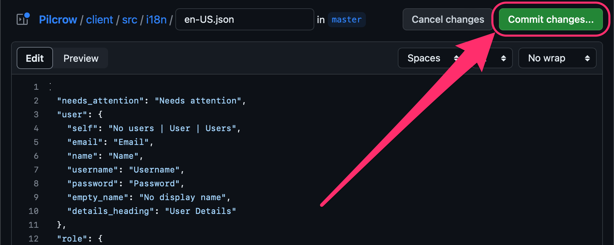
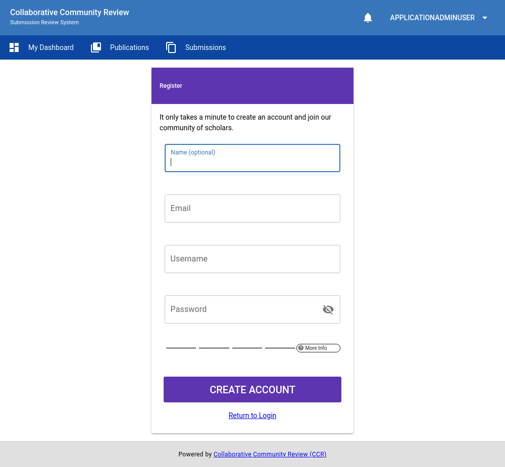
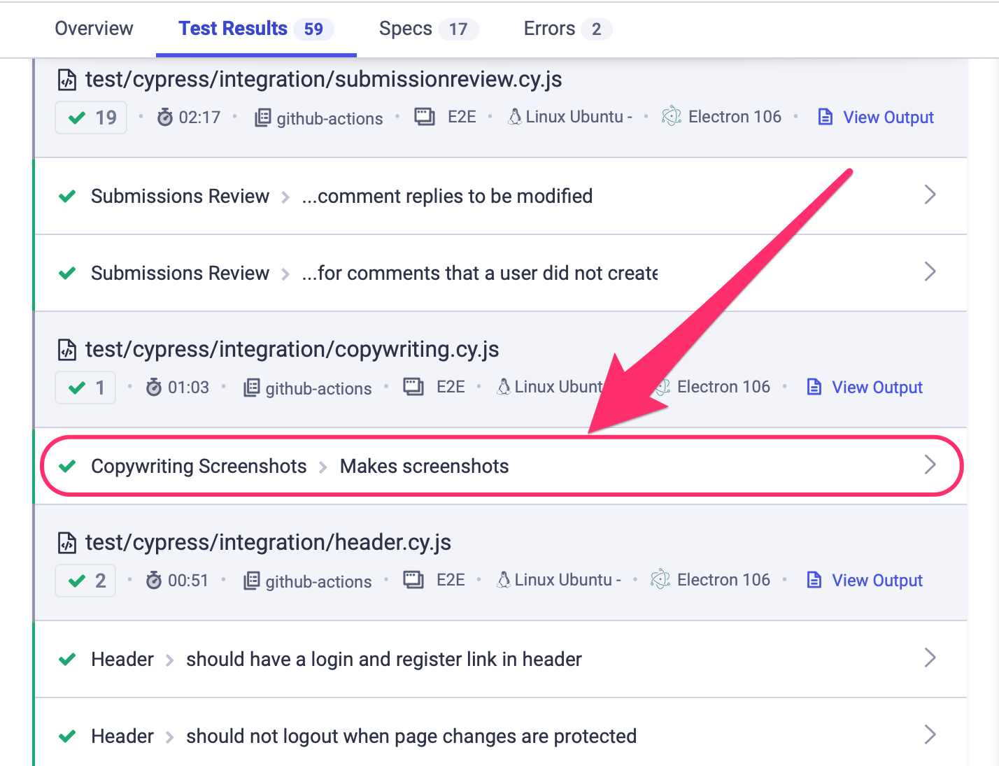

# Copyediting & Translation

Text (copy) that is present throghout Pilcrow is internationalized using [vue-i18n package](https://vue-i18n.intlify.dev/).  All translatable copy in the application is located in [`/client/src/i18n` on the GitHub repository](https://github.com/MESH-Research/Pilcrow/tree/master/client/src/i18n).

## Contributing

If you are interested in contributing translations, [please reach out to the team via GitHub](https://github.com/MESH-Research/Pilcrow/discussions).

### English (en-US)

If you have a GitHub account with writing access to [the GitHub repository](https://github.com/MESH-Research/Pilcrow), you may directly update the American English file (`en-US.json`) by following the instructions below. Otherwise, you can reach out to the [project team](index.md#team-members) to request writing access.

1. Visit the translation file on GitHub located at [client/src/i18n/en-US.json](https://github.com/MESH-Research/Pilcrow/blob/master/client/src/i18n/en-US.json).
2. Click the "Edit this file" button in the upper-right of the page.

      

3. Make your modifications directly to the translation text within the browser. Use the instructions for [screenshots](/developers/copyediting.md#screenshots) below for assistance.
4. Once finished, click the "Commit changes" button in the upper-right of the page.

      

5. A "Propose changes" dialog will appear. In the "Commit message" text input, replace the "Update en-US.json" placeholder with: `feat: Update en-US.json`.

      

    - Optionally, add a description of your changes to the "Extended description" textarea beneath this text input.
6. Click the "Propose changes" button.
7. Click the "Create pull request" button.

      

8. Done.
    - The development team will coordinate with you further to merge your changes and officially update the application's text.

If you need help, [please reach out to the team](https://github.com/MESH-Research/Pilcrow/discussions) for assistance.

## Translation Tools

### Screenshots

The automated testing tools for the application generate two screenshots of each page.  The first displays the page in `en-US` and the second replaces translated text strings with their key names in the translation file to aid in locating the appropriate key to modify for a given text string.

|  |  |
| :-----------------------------------: | :-----------------------------: |
| Translated Page                       | Translation Keys for Page       |

You can download a zip file of these screenshots inside a [recent passing run of the integration test suite](https://github.com/MESH-Research/Pilcrow/actions/workflows/test-e2e.yml). Any workflow run with a green checkmark will do.

Click on the title of a recent workflow run and look for the `screenshots` artifact at the bottom of the page.

Note: Screenshots are only saved for 14 days.

Screenshots are also viewable on Pilcrow's [cypress.io](https://dashboard.cypress.io/projects/omnycq/runs) profile. Click on a recent run and locate the "Copywriting Screenshots > Makes Screenshots" spec.

Click on that spec and you should find a button for screenshots in the flyout that opens.

### In-Browser Keys

If you are able to access/start a build of the application, you can also switch to the translation keys display mode by pressing `Ctrl+Shift+Alt+T`.  Pressing the key combination again will revert back to `en-US`. This setting will not be saved between page loads, but you can invoke the key combination as often as you need.
