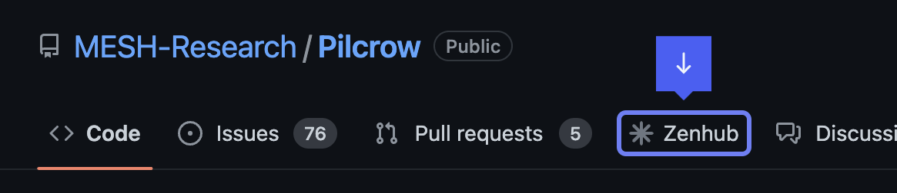

# Introduction

::: tip
Pilcrow is in the beginning phases of its development process. As such, much of this documentation is evolving quickly. Please check back frequently to see what has changed!
:::

## Project Organization

Most of the work of the project is handled on our [GitHub repo](https://github.com/MESH-Research/Pilcrow). The core team operates using an agile model, and we organize our sprints using [Zenhub](https://www.zenhub.com/). To access our Zenhub board, you can [sign up or log in on Zenhub](https://www.zenhub.com/sign-up).

If you have a supported browser, you can install the [Zenhub browser extension](https://www.zenhub.com/extension). Once installed, you'll see a new tab in GitHub for our Zenhub board.

## Contributor Workflow

1. Create a new branch based on the `master` branch
2. (Optional) If the project dependencies have changed compared to your local copy, you may want to rebuild to reprocess composer.json and package.json files:
    - Run `lando rebuild`
3. Work on your feature/fix
4. Open a pull request on GitHub to merge your branch into the `master` branch
5. Respond to feedback from the subsequent code review(s)
6. The pull request can be merged by a reviewer or a maintainer once approved

## Code Reviews

The Pilcrow project enforces a mandatory code review for every pull request on the project, including those from core developers and maintainers.  When you create a pull request, be sure to document in the pull request description:

- What features/fixes the PR addresses
- How to test the implementation

Reviewers should be able to follow your steps to confirm that the change works as expected.  **Reviewers should also review each changed file to:**

- point out improvements to the submission
- ask questions about unclear areas and
- catch bugs.

Reviews must be a good-faith effort on the part of both the reviewer and the submitter.  Reviewers should presume that mistakes are simple oversights, and submitters should assume that reviewers are looking out for the project.

## Tagging a release
We use [release-please](https://github.com/marketplace/actions/release-please-action) to manage releases.  When unreleased changes have been made to the master branch, release-please will open a pull request against master with the appropriate version number based on the types of changes made.

::: info Help, I'm can't find the release PR
If the release pull request isn't appearing, make sure you're making **releasable** changes to the project. (e.g. `fix`, `feature`).  Commit categories like `chore` shouldn't change the application source and therefore don't trigger a release.
:::

There are plenty of ways to control release-please's behavior described in [their documentation](https://github.com/googleapis/release-please)