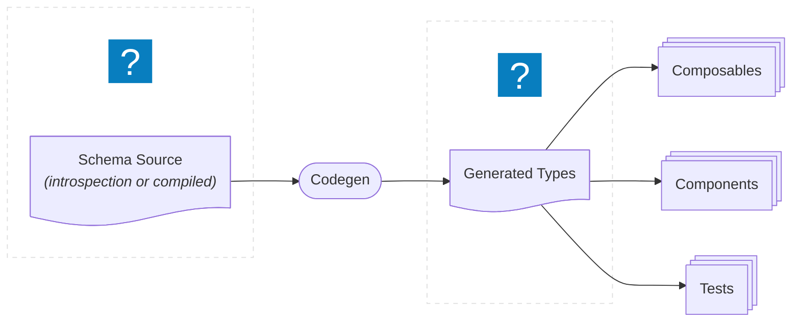

# TypeScript

All client code is TypeScript. New code must use TypeScript, and types should
flow from the GraphQL schema through codegen into components and tests.

For GraphQL code generation setup and configuration, see
[GraphQL Client](./graphql-client).

## Type Flow

When a field is renamed or removed in the backend schema, the generated types
change, and TypeScript surfaces errors in every component and test that
references the old shape. This is the primary value of typing mock data in tests
-- schema changes become compile errors instead of silent failures.

- [Conventions](./typescript-conventions) -- component patterns, provide/inject,
  utility types
- [GraphQL Types](./typescript-graphql) -- using generated types in tests
